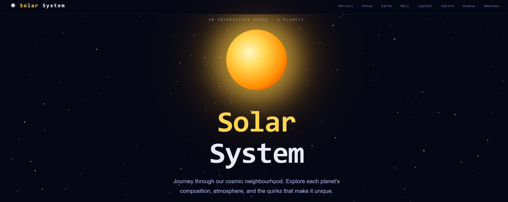
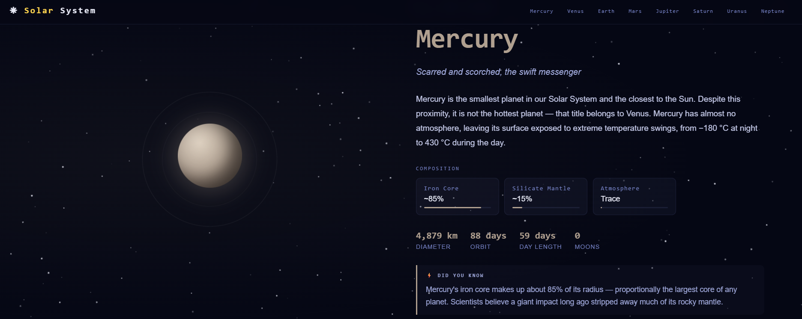
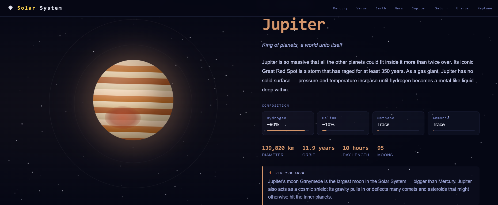

# 🌌 Solar System Explorer — React

An interactive, educational React website exploring all 8 planets of our Solar System. Built with **React 18 + Vite**, zero UI libraries — everything from scratch.


## ✨ Features

- **Animated planet visuals** — pure CSS spheres with realistic gradients, glow, Saturn rings, Jupiter's Great Red Spot, Earth's continents
- **Live starfield** — Canvas API animation via a custom React hook
- **Scroll-triggered reveals** — `IntersectionObserver` via a custom `useReveal` hook
- **Responsive** — two-column desktop, single-column mobile
- **CSS Modules** — zero class name collisions, fully scoped styles per component
- **Data-driven** — add a planet by editing one array in `src/data/planets.js`
- **Accessible** — `prefers-reduced-motion` respected in global CSS

## Screenshots





## 🚀 Getting Started

```bash
git clone https://github.com/klys11/solar-system-explorer.git
cd solar-system-explorer
npm install
npm run dev
```

Then open [http://localhost:5173](http://localhost:5173).

### Build for production

```bash
npm run build    # outputs to /dist
npm run preview  # preview the production build locally
```

## 📁 Project Structure

```
solar-system-explorer/
├── index.html                  # Vite HTML entry point
├── vite.config.js              # Vite + React plugin config
├── package.json
└── src/
    ├── main.jsx                # React root — mounts <App />
    ├── App.jsx                 # Root component, composes all sections
    │
    ├── data/
    │   └── planets.js          # ★ All planet content lives here
    │
    ├── hooks/
    │   ├── useReveal.js        # IntersectionObserver scroll-reveal hook
    │   └── useStarfield.js     # Canvas starfield animation hook
    │
    ├── styles/
    │   └── global.css          # Design tokens (:root vars), resets, utilities
    │
    └── components/
        ├── Starfield.jsx / .module.css     # Fixed canvas background
        ├── Navbar.jsx / .module.css        # Fixed top navigation
        ├── Hero.jsx / .module.css          # Opening section with animated Sun
        ├── PlanetSection.jsx / .module.css # Full-screen section per planet
        ├── PlanetVisual.jsx / .module.css  # Animated CSS sphere
        ├── PlanetInfo.jsx / .module.css    # Text panel (stats, composition, fact)
        └── Footer.jsx / .module.css        # Bottom footer
```

## 🛠️ Tech Stack

| Technology           | Usage                                |
| -------------------- | ------------------------------------ |
| React 18             | Component-based UI                   |
| Vite 5               | Dev server + build tool              |
| CSS Modules          | Scoped component styles              |
| Canvas API           | Animated starfield (via custom hook) |
| IntersectionObserver | Scroll reveal (via custom hook)      |
| Google Fonts         | Orbitron (display) + Inter (body)    |

## 🧑‍💻 Key Concepts

- **CSS Modules** (`.module.css`) — scoped styles, no global clashes
- **Custom hooks** — `useReveal` and `useStarfield` extract logic from components
- **Data-driven rendering** — `planets.map()` builds sections from a single data file
- **`useEffect` cleanup** — `cancelAnimationFrame` and `removeEventListener` prevent memory leaks
- **`useRef`** — direct DOM access for canvas and IntersectionObserver targets
- **CSS custom properties** — design tokens shared across all modules via `:root`
- **`clamp()`** — fluid responsive typography without media queries

## 🌍 Planets Covered

1. ☿ Mercury — The swift messenger
2. ♀ Venus — Our toxic twin
3. 🌍 Earth — The pale blue dot
4. ♂ Mars — The red frontier
5. ♃ Jupiter — King of planets
6. ♄ Saturn — Jewel of the Solar System
7. ⛢ Uranus — The sideways ice giant
8. ♆ Neptune — The windiest world

## 📄 License

MIT — free to use, modify, and share.

---
